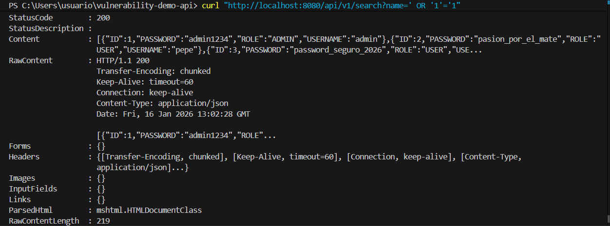

SecureAPI-Showcase: SQL Injection Lab

Este proyecto es un laboratorio controlado desarrollado en **Java 21** y **Spring Boot 4** para demostrar la identificación, explotación y mitigación de vulnerabilidades de **Inyección SQL (SQLi)**.

Objetivo:
El objetivo es proporcionar un entorno práctico para entender cómo las consultas concatenadas permiten la manipulación de la base de datos y cómo las **Consultas Parametrizadas** (Prepared Statements) eliminan este riesgo.

Tecnologías:
- Lenguaje: Java 21 (LTS)
- Framework: Spring Boot 4
- Base de Datos: H2 (In-memory)
- Build Tool: Maven

Estructura del Proyecto:
- `/api/v1/search`: Endpoint Vulnerable. Permite inyección de código mediante concatenación de Strings.
- `/api/v2/search`: Endpoint Seguro. Utiliza parámetros vinculados para sanitizar el input.

Pruebas de Concepto (PoC)

1. Explotación (V1)
Para recuperar toda la base de datos de usuarios sin conocer sus nombres:
```bash
curl "http://localhost:8080/api/v1/search?name=' OR '1'='1"

Evidencia del Ataque (PoC):
Así se ve cuando la API vulnerable (`/api/v1/search`) responde a un ataque de inyección SQL devolviendo todos los usuarios de la base de datos:


